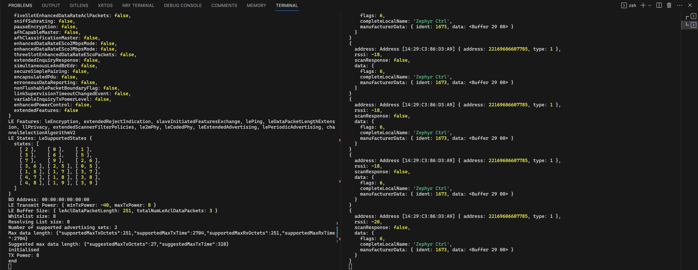

# Advertising and scanning using Coded PHY

To run this example it is necessary to have two nRF52840 dongles connected to your PC.

Open two terminals and run:

```sh
npm run build
node dist/examples/CodedPHY/advertising.ts --device-id 0
```

```sh
node dist/examples/CodedPHY/scanning.ts --device-id 1
```


