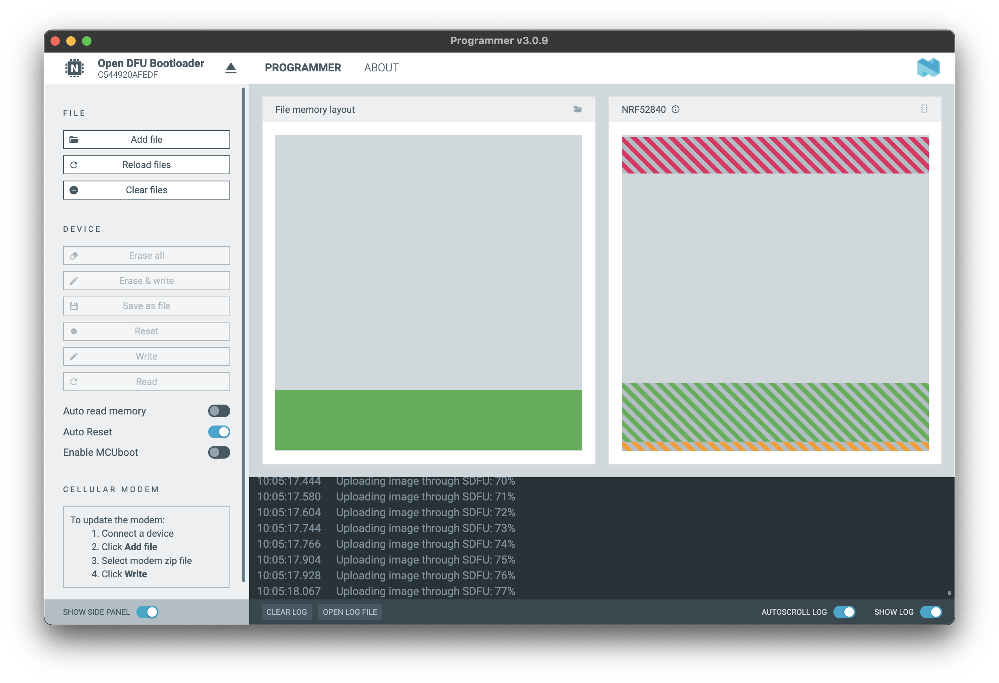

# Getting started with bluetooth-hci library

Follow this guide to set up and start using the `bluetooth-hci` library.

## 1. nRF52840 Dongle

This guide requires **nRF52840 Dongle**, two dongles are required to try some examples. One dongle works as a central device and the second as peripheral.


[nRF52840 Dongle Documentation](https://www.nordicsemi.com/Products/Development-hardware/nrf52840-dongle)

**Note**: The nRF52840 Dongle can be ordered through electronics distributors like:

- [Digi-Key](https://www.digikey.com/),
- [Farnell](https://www.farnell.com/),
- [Mouser](https://www.mouser.com/),
- [RS Components](https://www.rs-online.com/).

## 2. Install nRF Connect for Desktop

Download and install the **nRF Connect for Desktop** from the following link: [NRF Connect for Desktop](https://www.nordicsemi.com/Products/Development-tools/nRF-Connect-for-Desktop/Download?lang=en#infotabs).


## 3. Install the Programmer Tool

- Start `nRF Connect for Desktop`.
- Look for and install the `Programmer` tool.


## 4. Connect and program the nRF52840 Dongle

- Open the `Programmer` tool.
- Connect the **nRF52840 dongle** to your computer.
- Click on `Select Devices` and choose the dongle for flashing. It should appear on the list as **Open DFU Bootloader**.

## 5. Add firmware file

Locate and select the firmware file from `/zephyr/hci_uart/nrf52840dongle_nrf52840.hex`.

## 6. Flash the firmware

- Click on the `Write` button.
- Patiently wait for the flashing operation to complete.



## 7. Install dependencies and build

Run the following commands:

```sh
npm ci
npm run build
```

## 8. Run the example

Execute the example with:

```sh
node dist/examples/le-scanner.js
```

With these steps, you're now set up and running with the `bluetooth-hci` library!
