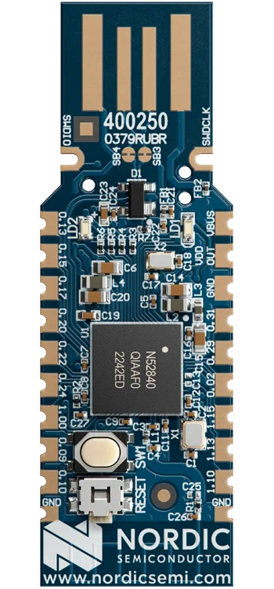

# Getting Started with n-ble Library

Follow this guide to set up and start using the `n-ble` library.

## 1. Order nRF52840 Dongle

Order the **nRF52840 Dongle**. It's recommended to order two pieces so one can function as the Bluetooth central and the other as the Bluetooth peripheral.



[nRF52840 Dongle Documentation](https://www.nordicsemi.com/Products/Development-hardware/nrf52840-dongle)

**Note**: The nRF52840 Dongle can also be ordered through electronics distributors like [Mouser](https://www.mouser.com/), [Digi-Key](https://www.digikey.com/), [Farnell](https://www.farnell.com/), or [RS Components](https://www.rs-online.com/).

## 2. Install nRF Connect for Desktop

Download and install the **nRF Connect for Desktop** from the following link: [NRF Connect for Desktop](https://www.nordicsemi.com/Products/Development-tools/nRF-Connect-for-Desktop/Download?lang=en#infotabs).


## 3. Install the Programmer Tool

- Start `nRF Connect for Desktop`.
- Look for and install the `Programmer` tool.


## 4. Connect and Flash the nRF52840 Dongle

- Open the `Programmer` tool.
- Connect the **nRF52840 dongle** to your computer.
- Click on `Select Devices` and choose the dongle for flashing. It should appear on the list as **Open DFU Bootloader**.

## 5. Add Firmware File

Locate and select the firmware file from `/zephyr/hci_usb/zephyr.hex`.

## 6. Flash the Firmware

- Click on the `Write` button.
- Patiently wait for the flashing operation to complete.


## 7. Install Dependencies and Build

Run the following commands:

```sh
npm ci
npm run build
```

## 8. Run the Example

Execute the example with:

```sh
npx ts-node examples/le-scanner.ts
```

With these steps, you're now set up and running with the `n-ble` library!
