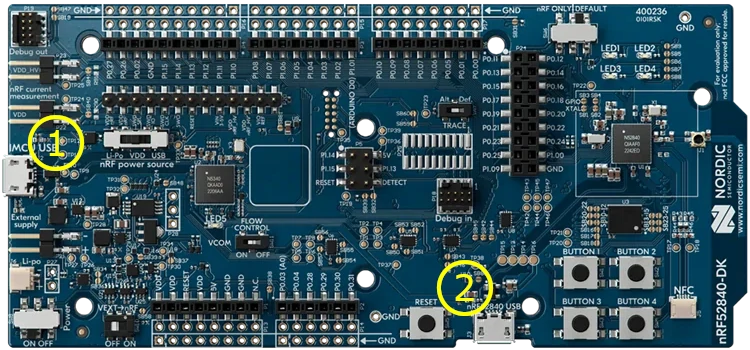
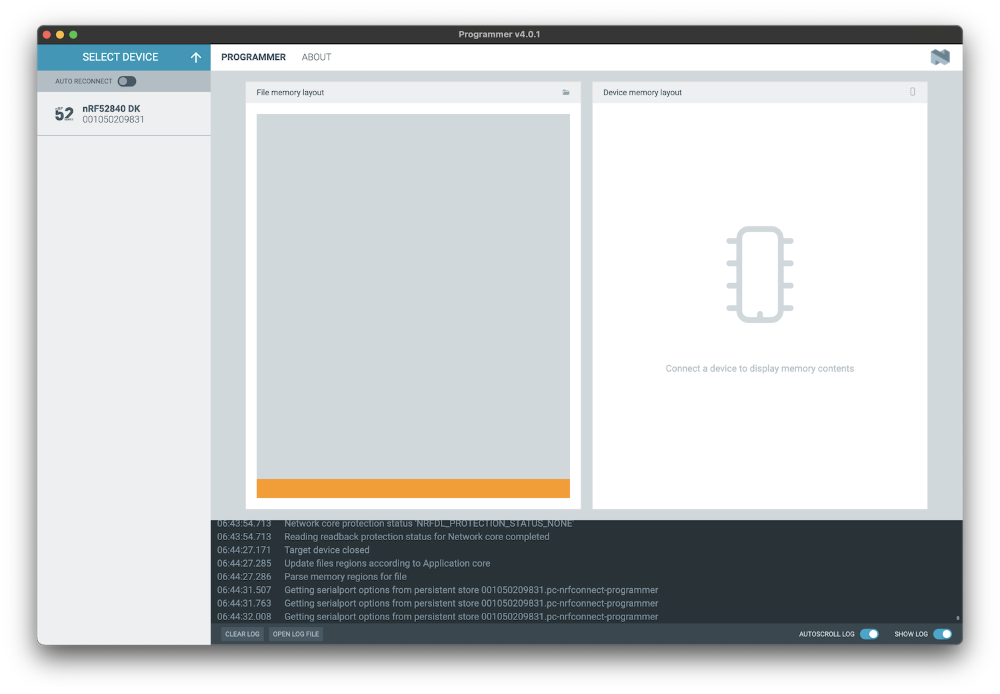
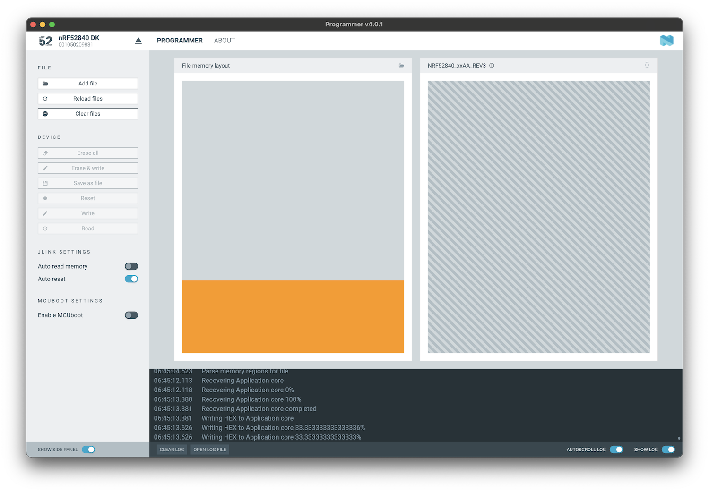

# nRF52840 DK

## 1. Introduction

This guide explains how to flash **nRF52840 dk** with pre-compiled HCI controller firmware.

[nRF52840 DK Documentation](https://www.nordicsemi.com/Products/Development-hardware/nrf52840-dk)

## 2. Install nRF Connect for Desktop

Download and install the **nRF Connect for Desktop** from the following link: [NRF Connect for Desktop](https://www.nordicsemi.com/Products/Development-tools/nRF-Connect-for-Desktop/Download?lang=en#infotabs).

## 3. Install the Programmer Tool

- Start `nRF Connect for Desktop`.
- Look for and install the `Programmer` tool.

## 4. Connect and program

- Open the `Programmer` tool.
- Connect the **nRF52840 DK** to your computer using the port marked in the image above as 1.
- Click on `Select Devices` and choose the device for flashing. It should appear on the list as **nRF52840 DK**.

## 5. Add firmware file

Locate and select the firmware file from `/zephyr/hci_uart/nrf52840dk_nrf52840.hex`.

## 6. Flash the firmware

- Click on the `Write` button.
- Patiently wait for the flashing operation to complete.

## 7. Final note

In order to use the DK as a Bluetooth HCI controller, connect it to your computer using the port marked in the image above as 2.
